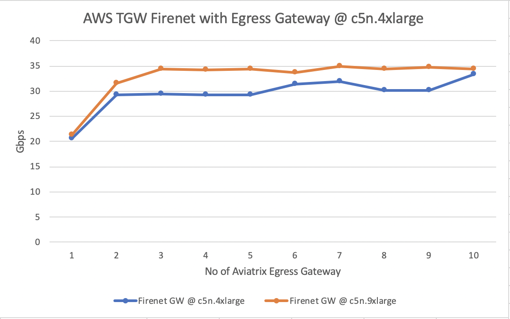
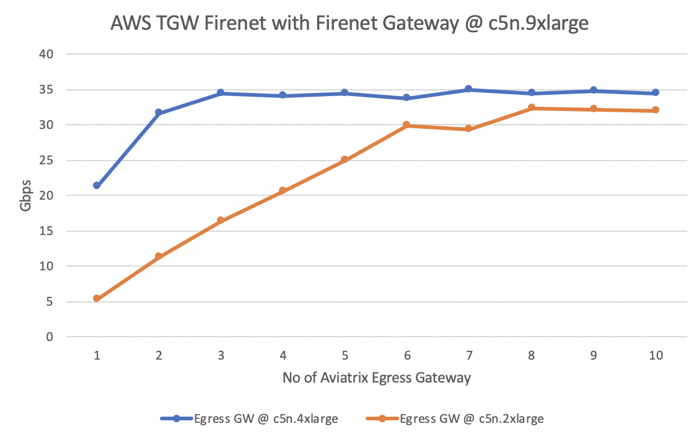

.. meta::
  :description: Aviatrix Transit Firenet and AWS TGW Firewall Network Performance benchmark

================================
Aviatrix Transit Firenet and AWS TGW Firewall Network Performance
================================

This document provides performance results on Aviatrix Transit Firenet and AWS TGW Firenet related deployment scenarios. Refer to `Transit Firenet FAQs <https://docs.aviatrix.com/HowTos/transit_firenet_faq.html>`_ and `Firewall Network FAQs <https://docs.aviatrix.com/HowTos/firewall_network_faq.html>`_ for more information about these use cases.

`Aviatrix Transit Firenet Performance <https://docs.aviatrix.com/HowTos/transit_firenet_faq.html#what-is-the-transit-firenet-performance>`_
---------------------

`AWS TGW Firewall Network Inspection (East-West, North-South) Performance <https://docs.aviatrix.com/HowTos/firewall_network_faq.html#what-is-the-maximum-performance-firenet-can-achieve>`_
--------------------

Aviatrix High Performance Encryption (HPE a.k.a. Insane mode) Transit Network with Egress Gateway
-------------------------

|avx_tr_firenet_egress|

Testing Environment:

1. Controller software version is 6.0.2466.
#. VPCs/VNETs were in the same region.
#. Deployments are based on HA scenario with Spoke and Transit Firenet gateways enabled with Insane Mode Encryption.
#. Aviatrix FQDN Egress Gateways (c5n.4xlarge) were used as the egress for the Internet bound traffic from spoke VPCs.
#. Buffer size in all iperf3 clients/servers were modified to avoid being a bottleneck. Refer to `instructions here <https://wwwx.cs.unc.edu/~sparkst/howto/network_tuning.php>`_ to tune TCP  window size.
#. iperf3 traffic was sent with MSS 1500 bytes unless specified.

|avx_insane_egress|

AWS TGW Firewall Network with Aviatrix Egress Gateway
----------------------------

|aws_tgw_firenet_egress|

Testing Environment:

1. Controller software version is 6.0.2466.
#. VPCs/VNETs were in the same region.
#. Deployments were based on HA scenario on Aviatrix Transit gateway.
#. Aviatrix FQDN Egress Gateways were used as the egress for the Internet bound traffic from spoke VPCs.
#. Buffer size in all iperf3 clients/servers were modified to avoid being a bottleneck. Refer to `instructions here <https://wwwx.cs.unc.edu/~sparkst/howto/network_tuning.php>`_ to tune TCP  window size.
#. iperf3 traffic was sent with MSS 1500 bytes unless specified.

|tgw_firenet_egress_c5n4xl|

|tgw_firenet_gw_c5n9xl|

