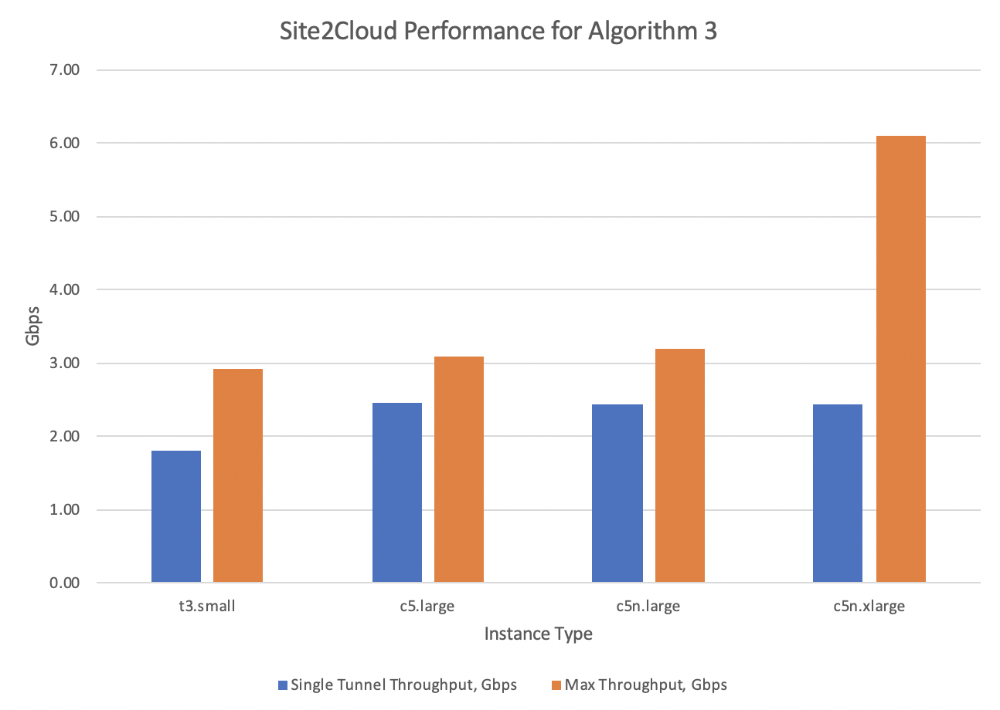

.. meta::
  :description: Site2Cloud Performance benchmark

================================
Site2Cloud IPSec VPN Performance
================================

This document provides Aviatrix gateway IPSec encryption performance test benchmarks for Site2Cloud with different algorithms. Refer to `Site2Cloud FAQs <https://docs.aviatrix.com/HowTos/site2cloud_faq.html>`_  for more information about Site2Cloud, 

|s2c_topo|

Testing Environment:

1. VPCs/VNETs were in the same region.
#. All test results are based on non-HA scenario.
#. Multiple remote sites were connected to a single Aviatrix gateway to simulate traffic from various remote sites.
#. Buffer size in all iperf3 clients/servers were modified to avoid being a bottleneck. Refer to `instructions here <https://wwwx.cs.unc.edu/~sparkst/howto/network_tuning.php>`_ to tune TCP  window size.
#. iperf3 traffic was sent with MSS 1400 bytes unless specified.

Algorithm 1:
~~~~~~~~~~~~

- Phase 1: SHA-1, AES-256-CBC, DH-2
- Phase 2: HMAC-SHA-1, AES-256-CBC, DH-2

|s2c_perf_algo1|

Algorithm 2:
~~~~~~~~~~~~

- Phase 1: SHA-256, AES-256-CBC, DH-14
- Phase 2: HMAC-SHA-256, AES-256-CBC, DH-14

|s2c_perf_algo2|

Algorithm 3:
~~~~~~~~~~~~

- Phase 1: SHA-256, AES-256-CBC, DH-14
- Phase 2: NO-AUTH, AES-128-GCM-96, DH-14

|s2c_perf_algo3|

Maximum IPSec tunnel per gateway = 1000

.. |s2c_perf_algo1| image:: site2cloud_perf_media/s2c_perf_algo1.png
   :scale: 30%

